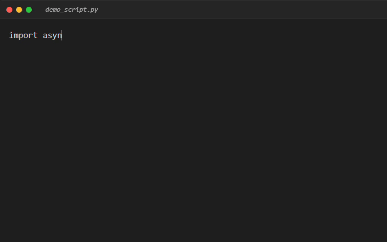

# HumanTyping 🤖⌨️


[](https://badge.fury.io/py/humantyping)
[](https://github.com/Lax3n/HumanTyping/actions/workflows/tests.yml)
[](https://www.python.org/downloads/)
[](https://opensource.org/licenses/MIT)

**The most realistic keyboard typing simulator** based on Markov Chains and stochastic processes.

HumanTyping models authentic human typing behavior with unprecedented accuracy, making automated typing indistinguishable from real users.

## 🎬 See It In Action



*Watch HumanTyping simulate realistic typing with natural speed variations, errors, and corrections.*

---

## ⚡ Quick Start (Playwright)

```bash
# Install
pip install -e .[playwright]
```

```python
from playwright.async_api import async_playwright
from humantyping import HumanTyper
import asyncio

async def main():
    async with async_playwright() as p:
        browser = await p.chromium.launch(headless=False)
        page = await browser.new_page()
        await page.goto("https://google.com")
        
        typer = HumanTyper(wpm=70)  # Create typer
        
        search_box = page.locator("[name='q']")
        await search_box.click()
        await typer.type(search_box, "realistic typing!")  # Type like a human!
        
        await browser.close()

asyncio.run(main())
```

📚 **[See More Examples →](./examples/)** | 🚀 **[Full Guide →](./QUICKSTART.md)**

---

## ✨ Features

### Advanced Typing Simulation
- **Variable Speed**: Common words typed 40% faster, complex words 30% slower
- **Bigram Acceleration**: Frequent letter pairs (th, er, in) typed in rapid bursts
- **Fatigue Modeling**: Typing speed gradually decreases over time (0.05% per character)
- **Natural Pauses**: Micro-pauses between words (250ms average)

### Realistic Error Patterns
- **Neighbor Errors**: Types adjacent keys based on keyboard layout (QWERTY/AZERTY)
- **Swap Errors**: Character inversions like "teh" → "the"
- **Delayed Detection**: Some errors go unnoticed until final proofreading
- **Correction Behavior**: Uses Backspace immediately or navigates with arrow keys later

### Customization
- Adjustable WPM (Words Per Minute) with natural variance
- Support for accents and special characters
- Uppercase detection (Shift key penalty)
- Configurable error rates and reaction times

---

## 🧠 How It Works

HumanTyping uses a **semi-Markov process** where:
- **States** represent typing progress (characters typed)
- **Transitions** model keystrokes with time and accuracy variations
- **Error probability** depends on:
  - Word difficulty (common vs. rare)
  - Key distance on the keyboard
  - Character complexity (accents, uppercase)
  
The system maintains both a **mental cursor** (where the user thinks they are) and a **physical cursor** (actual position), allowing realistic proofreading and corrections.

---

## 📦 Installation

### Option 1: Install from PyPI (Recommended) 🌟

**Once published to PyPI:**

```bash
# Basic installation
pip install humantyping

# With Playwright support
pip install humantyping[playwright]

# With Selenium support
pip install humantyping[selenium]

# With both
pip install humantyping[playwright,selenium]
```

### Option 2: Install from GitHub Releases

```bash
# Install latest release
pip install https://github.com/Lax3n/HumanTyping/releases/latest/download/humantyping-1.0.0-py3-none-any.whl
```

### Option 3: Install from Source (Development)

```bash
# Clone the repository
git clone https://github.com/Lax3n/HumanTyping.git
cd HumanTyping

# Install in editable mode
pip install -e .[playwright]

# Or with uv (recommended for development)
uv sync --extra playwright
```

### Verify Installation

```bash
python -c "from humantyping import HumanTyper; print('✓ Installation successful!')"
```

---

## 🚀 Usage

### Demo Mode (Visual Simulation)

Watch typing happen in real-time with errors and corrections:

```bash
uv run main.py "Hello world, this is a realistic typing test." --mode demo
```

**Options:**
- `--wpm <number>`: Set target typing speed (default: 60)
- `--mode demo`: Real-time animation

### Monte Carlo Mode (Statistical Analysis)

Generate statistics over multiple simulations:

```bash
uv run main.py "Performance test" --mode montecarlo --n 1000 --wpm 80
```

**Output:**
```
Running 1000 simulations for text: 'Performance test' (Target WPM: 80)

--- Monte Carlo Results ---
Estimated Mean Time : 3.2145 s
Standard Deviation  : 0.4521 s
Min / Max           : 2.1034 s / 5.8912 s
Computation Time    : 2.1456 s
```

---

## 🤖 Integration with Automation Frameworks

### Playwright (Async)

**The easiest way to add realistic typing to your Playwright scripts:**

```python
import asyncio
from playwright.async_api import async_playwright
from humantyping import HumanTyper  # Import from the package!

async def main():
    async with async_playwright() as p:
        browser = await p.chromium.launch(headless=False)
        page = await browser.new_page()
        await page.goto("https://example.com")
        
        # Create typer with custom WPM
        typer = HumanTyper(wpm=70)
        
        # Type realistically into any input field
        search_box = page.locator("input[name='search']")
        await search_box.click()
        await typer.type(search_box, "How to type like a human?")
        
        await browser.close()

if __name__ == "__main__":
    asyncio.run(main())
```

**That's it!** Just 3 lines of code:
1. Import `HumanTyper`
2. Create an instance: `typer = HumanTyper(wpm=70)`
3. Type: `await typer.type(element, "your text")`


### Selenium & Appium (Sync)

```python
from selenium import webdriver
from humantyping import HumanTyper

# For Selenium
driver = webdriver.Chrome()
driver.get("https://example.com")

human = HumanTyper(wpm=60)
search_box = driver.find_element("name", "search")
human.type_sync(search_box, "Typing with human-like behavior")

driver.quit()

# For Appium
# from appium import webdriver
# ... driver setup ...
# search_field = driver.find_element(by=AppiumBy.ACCESSIBILITY_ID, value='Search')
# human.type_sync(search_field, "Typing on mobile")
```

**The integration module handles all typing events:**
- Correct keystrokes
- Error keystrokes (wrong neighbors)
- Swap errors (character inversions)
- Backspace corrections
- Arrow key navigation (for late corrections)

---

## 🔧 Customization

Edit `src/config.py` to fine-tune the simulation:

```python
# Typing speed
DEFAULT_WPM = 60        # Base speed
WPM_STD = 10            # Variance between sessions

# Error rates
PROB_ERROR = 0.04       # 4% chance of typing wrong key
PROB_SWAP_ERROR = 0.015 # 1.5% chance of swapping two characters
PROB_NOTICE_ERROR = 0.85 # 85% chance to notice errors immediately

# Speed adjustments
SPEED_BOOST_COMMON_WORD = 0.6  # Common words 40% faster
SPEED_BOOST_BIGRAM = 0.4        # Frequent bigrams 60% faster
SPEED_PENALTY_COMPLEX_WORD = 1.3 # Complex words 30% slower

# Timing (seconds)
TIME_SPACE_PAUSE_MEAN = 0.25   # Pause between words
TIME_BACKSPACE_MEAN = 0.12     # Backspace press time
TIME_ARROW_MEAN = 0.15         # Arrow key navigation time
TIME_REACTION_MEAN = 0.35      # "Oops" delay after error

# Fatigue
FATIGUE_FACTOR = 1.0005        # 0.05% slowdown per character
```

---

## 📂 Project Structure

```
HumanTyping/
├── src/
│   ├── config.py         # All simulation parameters
│   ├── typer.py          # Core Markov model and state machine
│   ├── keyboard.py       # QWERTY/AZERTY layouts, key distances
│   ├── language.py       # Word difficulty, common bigrams
│   ├── simulation.py     # Demo and Monte Carlo runners
│   └── integration.py    # Playwright/Selenium integration
├── main.py               # CLI entry point
└── README.md
```

---

## 🤝 Contributing

**Forks and contributions are very welcome!**

Ideas for enhancements:
- Additional keyboard layouts (Dvorak, Colemak)
- Language-specific models (French, Spanish, etc.)
- Time-of-day fatigue patterns
- Muscle memory for repeated phrases
- Copy-paste detection avoidance

Open an issue or submit a PR!

---

## 📊 Example Output

```bash
uv run main.py "The quick brown fox jumps." --mode demo
```

```
--- Real-Time Simulation Demo: 'The quick brown fox jumps.' (Target WPM: 60.0) ---
Preparing simulation...

START TYPING:
----------------------------------------
The quick brown fox jumps.
----------------------------------------

Total Simulated Time: 6.2341s

Errors made and corrected: 1
```

---

## 🎯 Use Cases

- **Browser Automation**: Bypass typing detection systems
- **Testing**: Simulate realistic user input for QA
- **Research**: Study typing patterns and ergonomics
- **Education**: Demonstrate Markov processes and stochastic modeling

---

## 📜 License

MIT License - Feel free to use in your projects!

---

*Built with ❤️ and probabilities by the open-source community.*
